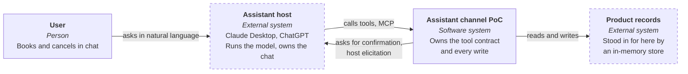
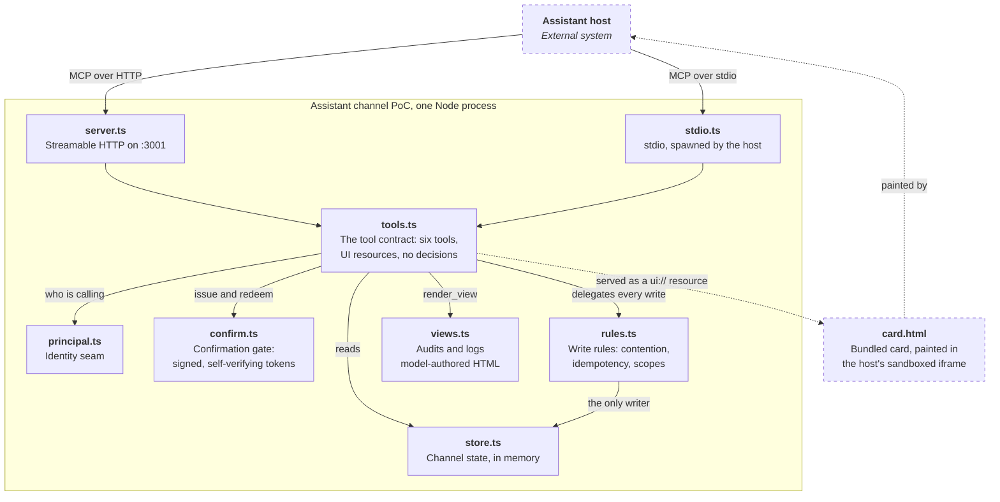

# Assistant channel PoC

A working reference implementation of the **assistant channel** shape: an existing product exposed to an assistant somebody else runs, as a set of tools it can call. You own the contract and the writes. You do not own the model, the chat, or the rendering.

Why each choice here was made, and what it cost, is in [decisions/](decisions/): every record exists because something was built, run against a real host, and found wrong in a way the specification did not predict.

## Demo

https://github.com/user-attachments/assets/11ef5754-0ab4-487e-b0de-80cd0f318932

## Why this exists

The usual demo of this shape guards one monotonic reading, the easiest guarded write there is: one user, one direction, no contention. It proves the shape and leaves the hard half untested.

Booking a slot is **contended** (two callers reach for the last place), **confirmed** (nothing saves without a human answering), and **idempotent** (a retried call does not book twice). Those three properties are why the write rules are your code rather than the model's judgement.

## Architecture

The system boundary is the point of the shape: the host owns the model, the chat and the rendering, and this repo owns the contract and the writes.



Inside the boundary, one Node process. The two entry points differ only in transport; everything below `tools.ts` is the same either way.



## Running it

```bash
npm install
npm test          # the write rules and the confirmation gate, no framework
npm start         # http://localhost:3001/mcp
```

Node 22.6+ only. TypeScript runs directly via native type stripping, so there is no build step and no `dist/`. Point a host at `http://localhost:3001/mcp` as an MCP server with no authentication, or drive it with curl:

```bash
curl -s -X POST http://localhost:3001/mcp \
  -H 'Content-Type: application/json' \
  -H 'Accept: application/json, text/event-stream' \
  -d '{"jsonrpc":"2.0","id":1,"method":"tools/call","params":{"name":"list_slots","arguments":{}}}'
```

## Two entry points

| Entry | Transport | Use when |
|---|---|---|
| `npm start` | Streamable HTTP on :3001 | A cloud host has to reach you, so you also need a tunnel or a deployment |
| `npm run start:stdio` | stdio | The host can spawn a process locally: no port, no tunnel, no public address |

A cloud host needs a publicly reachable HTTPS address and, on a managed workspace, an administrator who has enabled custom connectors. A host that spawns a local process needs neither. Same tool contract either way, which is the point of keeping the contract separate from the transport.

## Claude Desktop

Add this to `~/Library/Application Support/Claude/claude_desktop_config.json`, then quit Claude completely and reopen it; the config is only read at launch.

```json
{
  "mcpServers": {
    "assistant-channel-poc": {
      "command": "node",
      "args": ["/absolute/path/to/assistant-channel-poc/src/stdio.ts"]
    }
  }
}
```

The server appears under the "Add files, connectors, and more" control, via Connectors, then Manage connectors. If it does not, `tail -f ~/Library/Logs/Claude/mcp*.log` says why: the usual causes are a relative path in `args`, which must be absolute, and a `command` that is not on the app's PATH.

## ChatGPT

ChatGPT cannot reach `localhost`, so the server needs a public HTTPS address:

```bash
npm start                 # terminal one
ngrok http 3001           # terminal two, copy the https URL
```

Then **Settings → Connectors → create a custom connector**, paste `https://<your-ngrok-host>/mcp`, authentication none. Custom connectors need Plus or above; on a Business or Enterprise workspace developer mode is off until an administrator enables it under Workspace Settings → Permissions & Roles → Connected Data.

Worth trying, in order: ask what slots are available (plain text, no card), show your bookings (the card), book `slot-101` (refused, then asked, then booked), book it again (replayed, nothing changes), ask who you are (the shared demo account, which is the point).

Two things that will catch you out. A free ngrok URL changes every restart, so the connector points at a dead host. And ChatGPT snapshots what a connector can do when you first add it, so after changing tools you remove and re-add rather than toggling off and on.

### Why the card is registered twice

The two host families do not agree on how a tool declares a UI:

| | Tool metadata | Resource mimeType | Data reaches the card via |
|---|---|---|---|
| MCP Apps (Claude, Copilot) | `_meta.ui.resourceUri` | `text/html;profile=mcp-app` | a postMessage |
| OpenAI Apps SDK (ChatGPT) | `_meta["openai/outputTemplate"]` | `text/html+skybridge` | `window.openai.toolOutput` |

One HTML file, registered under two URIs, and `get_bookings` advertises both keys. Each host reads the one it knows and ignores the other. This is what a host-neutral tool contract actually costs today. [0005](decisions/0005-declare-the-card-twice.md)

## The tools

| Tool | Reads or writes | What it demonstrates |
|---|---|---|
| `whoami` | read | The identity seam, and that this preview shares one account |
| `list_slots` | read | Plain structured output, no card |
| `get_bookings` | read | A card view, via a `ui://` MCP Apps resource |
| `book_slot` | write | Confirmation, contention, idempotency |
| `cancel_booking` | write | Idempotent undo, and not leaking other people's booking ids |
| `render_view` | write | The model authoring the surface itself, audited but not withheld |
| `render_view` | read | The Open-ended tier with the model actually authoring the surface |

### Who designed the thing on screen

`get_bookings` and `render_view` both ship a whole HTML surface, and they are not the same
shape underneath. The card is a file in this repository, so the model chooses nothing about
it: Open-ended by delivery, Controlled by authorship. `render_view` takes the HTML as a tool
argument, so the model owns every pixel and we own only the frame around it.

The surface travels in the tool result, not in the resource. The host reads the resource
before it calls the tool, so a server-side substitution renders an empty frame every time.
The resource is the template and the tool result is the data, the same division the card
already uses.

The model's surface can also talk back, which is what separates this tier from a picture.
The frame carries one delegated click handler and the contract is a single verb: any element
the model marks with `data-say="..."` becomes clickable, and clicking it sends that text to
the conversation as if the user had typed it. No script runs from the model's HTML and
nothing is exposed on `window`, so the model can compose anything and still has exactly one
way to reach the agent.

That second tool has no enforcement point. There are no variants to withhold, because there
are no components, so the only instrument left is the tool description asking the model to
style with the host's own tokens and never to invent a colour. Nothing checks that it did.

Which is measurable rather than arguable. Every submitted surface is appended to `views.log`,
and the tally reports how often asking nicely worked:

```bash
npm run tally:views
```

```
surfaces        2
compliant       1 (50%)
colours invented 0
tokens invented 1: --color-success
tokens used     --font-sans x2, --color-text-primary x2, --color-border-secondary x2
  2026-08-25T19:39:03.610Z  invented --color-success
```

That invented token is the finding worth reading [0007](decisions/0007-an-invented-token-is-an-invented-colour.md)
for. Asked to use the host's tokens, the model wrote `var(--color-success, green)`, which no
host sends, so the fallback painted and the green was its own. The surface cited the design
system without using it, and the first version of the audit agreed with it.

The audit never appears in the tool's text response, only in its structured output. Telling
the model it broke the rule would have it correct itself, and unprompted compliance is the
number worth having.

## What each file is for

```
src/principal.ts    the identity seam: one function, currently a constant
src/rules.ts        the write rules: the only place determinism lives
src/confirm.ts      the confirmation gate: server-issued, single use
src/store.ts        channel state, in memory
src/views.ts        the view broker: audits and logs model-authored HTML
src/tools.ts        the tool contract: declarations and plumbing, no decisions
src/views.ts        the surface log and the audit that measures compliance
src/app/view.ts     the frame: host styling, and the one verb the surface can call
src/server.ts       HTTP entry point
src/stdio.ts        stdio entry point
src/app/card.ts     the card, built against the ui/ dialect
src/app/card.html   generated by npm run build:card, committed, do not edit
test/               the checks that fail if the rules or the gate break
```

`card.html` is a bundle: `npm run build:card` inlines `card.ts` and `card.css` into it, because a sandboxed iframe cannot fetch from another origin. It is committed on purpose, since hosts spawn `node src/stdio.ts` directly and never run an npm script.

Decisions belong in `rules.ts`, which is why that is the file with tests and the only one that knows nothing about MCP. If logic starts accumulating in `server.ts`, the shape has drifted.

## Three things worth reading the code for

**The confirmation is issued by the server, not claimed by the model.** The first version took a `confirm: boolean` argument, and a real host broke it in under a minute: told "Book slot-101", the model set it true on the first call, reasoning that the instruction was itself the agreement, and the booking landed with nothing asked. So `book_slot` now tries host elicitation first, and where the host will not answer one, refuses and hands back a signed token bound to that exact change. The token carries its own proof rather than being looked up, so any replica can verify one it did not issue; set `CONFIRMATION_SECRET` so they share it. It does not prove a human said yes, and it can be replayed until it expires, which the idempotent, contention-checked write path underneath absorbs. [0003](decisions/0003-server-issued-confirmation.md), [0004](decisions/0004-self-contained-confirmation-token.md)

**Identity is one function.** `resolvePrincipal` ignores the request and returns a shared demo account. That single fact is what makes this a preview and not a pilot: everyone who connects sees and mutates the same records. Swapping the body for token verification is the whole change; nothing else in the server reads the request.

**Tool annotations are hints, not controls.** Clients are required to treat annotations from untrusted servers as untrusted, so `idempotentHint` on `book_slot` and `destructiveHint` on `cancel_booking` inform display, never safety. The actual guarantees are enforced in `rules.ts` and tested.

## What this is not

- **Not authenticated.** One shared principal, no OAuth. Every connection is the same account.
- **Not durable.** State is in memory and dies with the process.
- **Not a product integration.** The store stands in for the real APIs a facade would call.
- **The card is read-only.** It renders what `get_bookings` returns and does not call tools back, though the `App` class it uses supports that.

Each of those is a deliberate shortcut with a named ceiling, marked with a `ponytail:` comment where it lives in the code.
